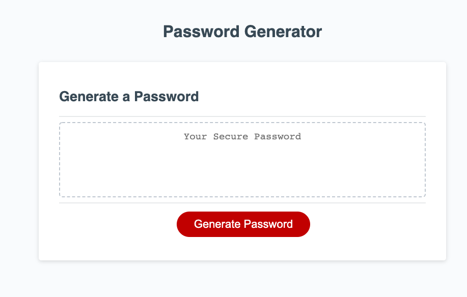
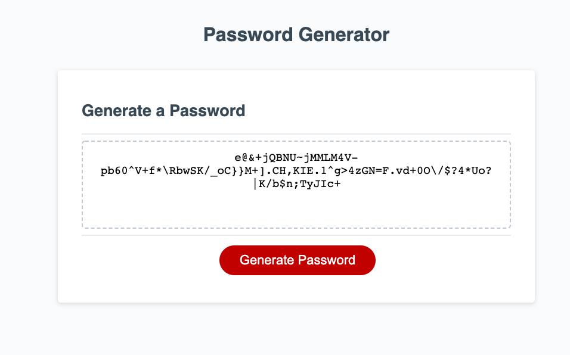

# 03_password_generator

## Table of contents
* [General info](#general-info)
* [Technologies](#technologies)
* [Setup](#setup)

## General info
The Password Generator is a web-based password generator. 

Click the "Generate Password" button on the center of the page and follow the prompts.

First, you will choose a length (in characters) for your password. Then choose which characters it will contain.

A lowercase letter is one of: "abcdefghijklmnopqrstuvwxyz";
An uppercase letter is one of: "ABCDEFGHIJKLMNOPQRSTUVWXYZ"
A number is one of: "0123456789";
and a special character is one of: "~`!@#$%^&*()_-+={[}]|\\:;\"'<,>.?/" 

This projects was created as the third homework assignment for the part-time coding bootcamp at the University of Kansas.

## Technologies
Project is created with:
* HTML
* CSS
* JavaScript
	
## Setup
To run this project, open the following URL in any modern web browser:

https://gregstead.github.io/03_password_generator/

The GitHub repository is located at: 

https://github.com/gregstead/03_password_generator